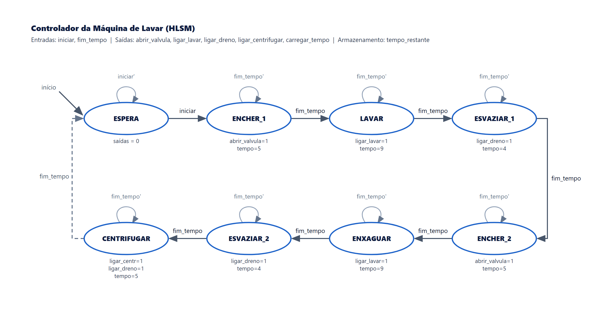
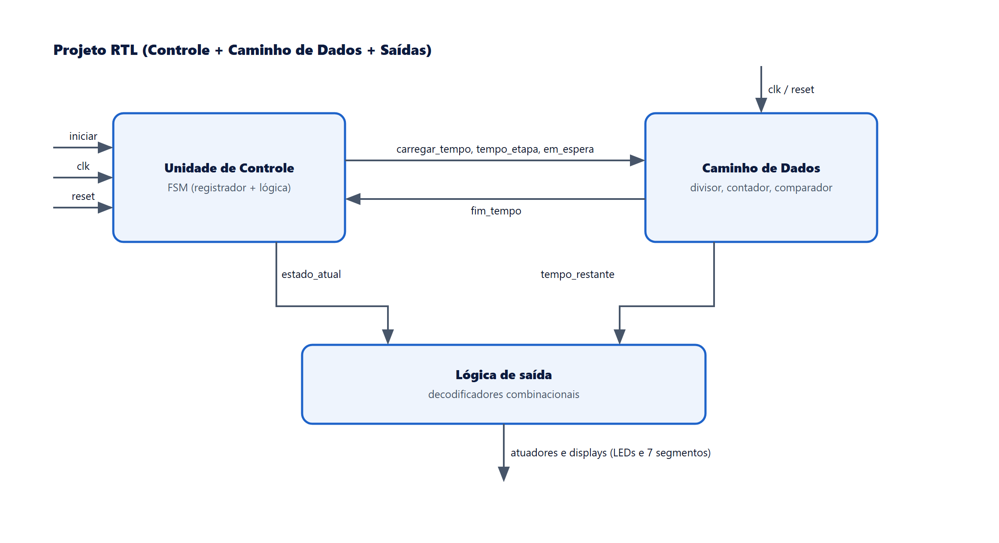
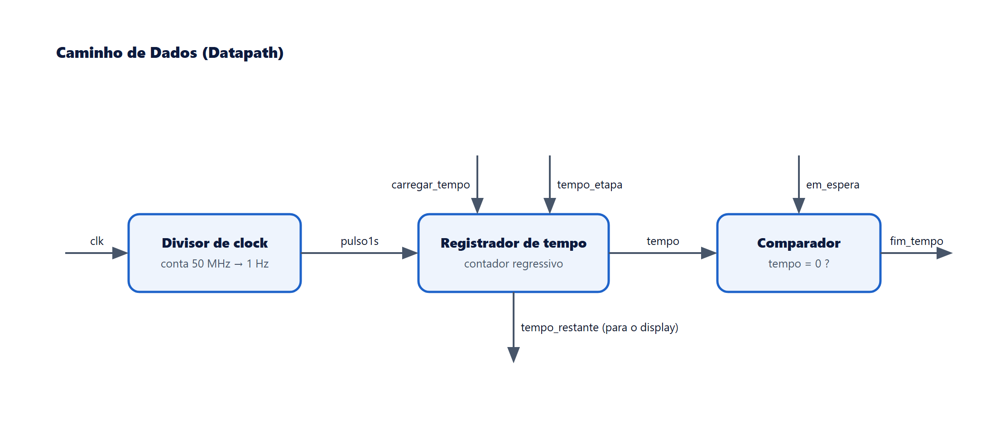

# Controlador de Máquina de Lavar (Projeto RTL)

Projeto da disciplina de Sistemas Digitais (Turma 03 - DCA3301) da UFRN. Implementa em VHDL o
controlador de uma máquina de lavar, modelado como uma máquina de estados de alto
nível (HLSM), descrito em RTL e sintetizado na placa FPGA Altera DE2 (Cyclone II).

## Funcionamento

A máquina executa um ciclo de lavagem com oito estágios em sequência, cada um com um
tempo próprio. O usuário inicia o ciclo por uma chave de iniciar e pode reiniciar o
sistema pela chave de reset. Um display de sete segmentos mostra o estágio atual e
outro mostra a contagem regressiva do tempo da etapa.

| Estágio | Ação | Tempo |
|---------|------|-------|
| Espera | Aguarda o início | indefinido |
| Encher 1 | Abre a válvula de água | 5 s |
| Lavar | Liga o motor de lavar | 9 s |
| Esvaziar 1 | Liga a bomba de dreno | 4 s |
| Encher 2 | Abre a válvula de água | 5 s |
| Enxaguar | Liga o motor de lavar | 9 s |
| Esvaziar 2 | Liga a bomba de dreno | 4 s |
| Centrifugar | Liga centrífuga e dreno | 5 s |

## Arquitetura

O comportamento foi modelado como uma máquina de estados de alto nível (HLSM): além dos oito estados, há uma variável de tempo que é carregada no início de cada etapa e decrementada a cada segundo.

A partir da HLSM, o projeto foi separado em uma unidade de controle (a FSM), um caminho de dados (o cronômetro das etapas) e a lógica de saída que gera os atuadores e os displays.

O caminho de dados é formado pelo divisor de clock (que gera um pulso por segundo a partir do clock de 50 MHz), pelo registrador de tempo (contador regressivo) e pelo comparador que sinaliza o fim do tempo da etapa.

## Organização do código

| Arquivo | Descrição |
|---------|-----------|
| `controlador.vhd` | Máquina de estados (registrador de estado e lógica de próximo estado) |
| `datapath.vhd` | Divisor de clock e contador regressivo de tempo |
| `maquina_lavar.vhd` | Topo que liga o controlador ao datapath e gera as saídas |

O projeto do Quartus está nos arquivos `maquina_lavar.qpf` e `maquina_lavar.qsf`.

## Documentação

A pasta `Docs` contém o relatório, os slides da apresentação e o vídeo da máquina
funcionando na placa (`Docs/video-fpga`).

## Integrantes

- João Victor Taveira Medeiros
- Deyvid Alexandre Nunes de Macedo
- Fernando Castro Gadelha
- Felipe Augusto Figueiredo da Silva
